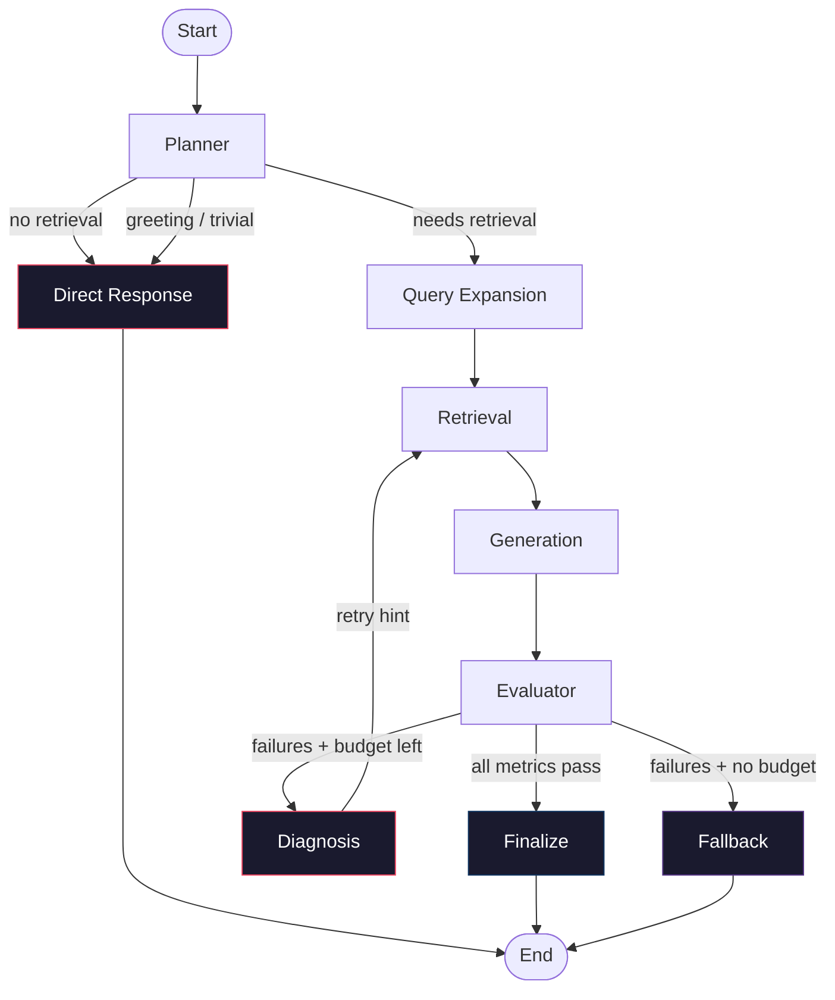

<div align="center">

# Compass

### Self-Evaluating RAG Agent

**A document-grounded QA system that retrieves, generates, evaluates its own answer, diagnoses failures, and retries with a different strategy — until it is confident or falls back gracefully.**

[](https://www.python.org/downloads/)
[](https://github.com/langchain-ai/langgraph)
[](https://github.com/langchain-ai/langchain)

</div>

---

## Why Compass?

Conventional RAG pipelines follow a straight line:

```
retrieve → generate → answer
```

If the retrieval is wrong, the answer is wrong. If the context is irrelevant, the model hallucinate. There is no second chance.

Compass adds a self-evaluation loop that checks the quality of its own output and attempts recovery:

```
retrieve → generate → evaluate → diagnose → retry → finalize / fallback
```

The system scores its own answer on four dimensions. If any metric falls below a threshold, a diagnosis step determines *what went wrong* and *which retrieval strategy to try next*. The agent retries with a different tool, a rewritten query, or stricter grounding — until it passes or exhausts its budget.

When it cannot reach sufficient confidence, it returns the best attempt it has rather than a bad answer.

---

## Key Features

| Category | Feature |
|----------|---------|
| **Ingestion** | Multi-format document loading (PDF, TXT, MD, DOCX) |
| **Collections** | Isolated document sets with independent vector and BM25 indexes |
| **Retrieval** | 8 tools: vector, BM25, hybrid RRF, query rewrite, multi-query, reranker, MMR, metadata filter |
| **Orchestration** | LangGraph state machine with conditional routing and retry loops |
| **Evaluation** | LLM-as-a-judge scoring 4 RAGAS-style metrics at runtime |
| **Recovery** | Diagnosis-driven retry that changes retrieval strategy per failure type |
| **Fallback** | Returns the best historical attempt when max iterations are exhausted |
| **UI** | Gradio interface with collection management, upload, and chat |
| **Benchmarking** | Offline evaluation with retrieval metrics (MRR, nDCG, Recall@K) and LLM judge |

---

## Architecture



### Components

| Node | Role |
|------|------|
| **Planner** | Decides whether the query needs document retrieval or can be answered directly. Bypasses the RAG pipeline entirely for greetings and trivial queries. |
| **Query Expansion** | Optionally rewrites the query using an LLM for better retrieval recall. |
| **Retrieval** | The LLM selects one of 8 retrieval tools based on the query and any retry guidance from the diagnosis step. |
| **Generation** | Produces an answer grounded in the retrieved context. Supports a strict mode when faithfulness has previously failed. |
| **Evaluator** | Scores the answer on 4 dimensions using an LLM judge. |
| **Diagnosis** | Maps failed metrics to concrete retry instructions (e.g., "switch to hybrid search", "use query rewrite"). |
| **Finalize** | Returns the answer with confidence = High or Medium based on average score. |
| **Fallback** | Selects the best-scoring attempt from history when the iteration budget is exhausted. Returns confidence = Low. |
| **Direct Response** | Lightweight path for non-document queries — answers directly and exits. |

### Shared State

Every node reads from and writes to a shared `RAGState` TypedDict. This state carries the query, retrieved chunks, tool history, evaluation scores, attempt history, and control flow signals across the entire graph. Nodes are pure functions: state in, partial state update out.

---

## How It Works

### 1. Upload & Ingest

Upload one or more documents through the UI or programmatically. The ingestion pipeline:

1. **Loads** each file using the appropriate loader (PDF via PyPDFLoader, DOCX via Docx2txtLoader, TXT/MD via TextLoader)
2. **Chunks** documents using `RecursiveCharacterTextSplitter` (2000 chars, 150 overlap)
3. **Embeds** chunks using `BAAI/bge-small-en-v1.5` via HuggingFace
4. **Stores** vectors in a Chroma collection
5. **Builds** a BM25 index (tokenized with whitespace splitting, stored as a pickle)

Each document set lives in an isolated collection under `collections/<id>/` with its own vector DB and BM25 index.

### 2. Activate a Collection

Calling `set_active(collection_id)` points all 8 retrieval tools at that collection's indexes. Collections are completely isolated — querying one never touches another's data.

### 3. Ask a Question

The full pipeline runs:

1. **Planner** checks if retrieval is needed. Greetings and short queries bypass the RAG pipeline entirely via `direct_response_node`.
2. **Query Expansion** optionally rewrites the query if the planner flagged it as complex or ambiguous.
3. **Retrieval** — the LLM picks a tool from the 8 available options, executes it, and returns deduplicated chunks.
4. **Generation** builds a context string from chunks and produces a grounded answer with source citations.
5. **Evaluator** scores the answer on context precision, context recall, faithfulness, and answer relevancy.
6. **Diagnosis** maps any failed metrics to a concrete retry instruction.
7. The agent **retries** with a different retrieval strategy (e.g., switching from vector to hybrid, or applying query rewrite).
8. When all metrics pass → **Finalize**. When the budget runs out → **Fallback** (best historical attempt).

---

## Self-Evaluation Loop

This is the core differentiator. After every generation, the evaluator LLM scores the output on four dimensions:

| Metric | What It Measures | Threshold |
|--------|-----------------|-----------|
| **Context Precision** | How much of the retrieved context is actually relevant to the question | 0.70 |
| **Context Recall** | Whether the context contains everything needed to answer fully | 0.70 |
| **Faithfulness** | Whether every claim in the answer is grounded in the retrieved context | 0.80 |
| **Answer Relevancy** | Whether the answer actually addresses the question asked | 0.75 |

### How Failures Drive Retries

Each failed metric triggers a different recovery strategy:

| Failed Metric | Diagnosis | Retry Action |
|---------------|-----------|--------------|
| Context Precision | Retrieved too much irrelevant context | Widen retrieval, then rerank to cut noise |
| Context Recall | Missing important information | Switch to hybrid search or multi-query expansion |
| Faithfulness | Answer made unsupported claims | Tighten grounding — no new retries, just stricter generation |
| Answer Relevancy | Answer drifted from the question | Rewrite the query for better retrieval alignment |

The faithfulness failure is special: it does not change the retrieval strategy. Instead, it flags the generation step to use a **strict grounding prompt** on the next pass, which explicitly forbids inference beyond what the context states.

### Why This Matters

A simple RAG chain answers once and stops. Compass answers, checks itself, diagnoses the failure mode, and retries with a different approach. This makes it significantly more robust for complex, multi-hop, or ambiguous queries where the first retrieval attempt is often insufficient.

---

## Retrieval System

Compass provides 8 retrieval tools, each suited to different query types:

| Tool | Strategy | Best For |
|------|----------|----------|
| `vector_search_tool` | Cosine similarity on embeddings | Semantic / conceptual questions |
| `bm25_search_tool` | BM25Okapi lexical ranking | Exact names, dates, prices, terminology |
| `hybrid_search_tool` | Vector + BM25 with Reciprocal Rank Fusion (k=60) | When both meaning and exact terms matter |
| `query_rewrite_tool` | LLM rewrites query, then vector search | Poorly phrased or ambiguous queries |
| `multi_query_tool` | Generates 3 variant queries, merges results | Complex multi-aspect questions |
| `reranker_tool` | Retrieves 30 candidates, reranks with cross-encoder | When relevant docs exist but rank poorly |
| `mmr_tool` | Maximal Marginal Relevance (fetch_k=30, λ=0.5) | Multi-document / comparison questions |
| `metadata_filter_tool` | Chroma similarity with `doc_type` filter | Restricting to a specific document category |

The LLM selects which tool to use based on the query and any retry guidance from the diagnosis step. On retries, the diagnosis hint steers the agent toward a different strategy — this is how the system learns from its own failures within a single query.

---

## Evaluation & Benchmarking

Compass distinguishes between two evaluation modes:

### Runtime Self-Evaluation

Runs inside the agent loop after every generation. Uses an LLM judge to score 4 metrics (context precision, context recall, faithfulness, answer relevancy) on a 0–1 scale. No reference answer is required — this is what drives the retry loop.

### Offline Benchmarking

Uses a gold-standard question set with reference answers to measure system quality. Two separate evaluation suites:

| Script | Questions | Purpose |
|--------|-----------|---------|
| `evaluation/baseline.py` | 10 (gold_set.jsonl) | Baseline RAG pipeline (retrieve + generate, no self-evaluation) |
| `evaluation/agent_benchmark.py` | 6 (eval-agent.jsonl) | Full LangGraph agent with self-evaluation loop |
| `retrieval/tool_benchmark.py` | 10 (gold_set.jsonl) | Compares 5 retrieval strategies head-to-head |

#### Retrieval Metrics

| Metric | Description |
|--------|-------------|
| **MRR** | Mean Reciprocal Rank — how early the first relevant document appears |
| **nDCG@K** | Normalized Discounted Cumulative Gain — ranking quality |
| **Recall@K** | Fraction of relevant keywords found in top-K results |
| **Precision@K** | Fraction of top-K results that are relevant |
| **Keyword Coverage** | Percentage of query keywords found (Recall × 100) |
| **Hit Rate@K** | Whether at least one relevant document appears in top-K |

#### LLM-as-a-Judge Answer Metrics

A separate LLM call scores the generated answer against the reference answer on 5 dimensions (1–5 scale):

- **Correctness** — factual accuracy vs. reference
- **Completeness** — how completely the question is answered
- **Relevance** — how directly the answer addresses the question
- **Faithfulness** — how well claims are supported by retrieved context
- **Overall** — aggregate quality assessment

> **Note:** Ragas is not used. All evaluation metrics are implemented from scratch in `evaluation/metrics.py`.

---

## Document Ingestion & Collections

### Collection Architecture

Each document set is an isolated collection with its own storage:

```
collections/<collection_id>/
    uploads/          # raw uploaded files
    vector_db/        # Chroma persistence directory
    bm25.pkl          # pickled BM25Okapi index + document chunks
```

A JSON registry (`collections/registry.json`) tracks all collections with metadata: name, file list, document count, chunk count, and status.

### How Collections Work

1. **Create** — `create_collection()` generates an ID, creates the directory structure, and registers the collection.
2. **Ingest** — `ingest_files()` loads documents, chunks them, builds both vector and BM25 indexes.
3. **Activate** — `set_active(collection_id)` points all retrieval tools at that collection.
4. **Query** — All 8 retrieval tools automatically use the active collection's indexes.
5. **Switch** — Call `set_active()` with a different ID to query a different document set.
6. **Delete** — `delete_collection()` removes the directory and registry entry.

Collections are fully isolated. A query against collection A never reads from collection B's indexes.

---

## Supported Documents

| Format | Extension | Loader |
|--------|-----------|--------|
| PDF | `.pdf` | `PyPDFLoader` (preserves page numbers) |
| Plain Text | `.txt` | `TextLoader` (UTF-8) |
| Markdown | `.md` | `TextLoader` (UTF-8) |
| Word Document | `.docx` | `Docx2txtLoader` |

Additional formats can be added by implementing a loader function in `ingestion/loaders.py` and registering it in the `LOADERS` dict.

---

## Installation

```bash
# Clone the repository
git clone https://github.com/your-username/compass.git
cd compass

# Create a virtual environment
python -m venv .venv
source .venv/bin/activate  # on Windows: .venv\Scripts\activate

# Install dependencies
pip install -r requirements.txt

# Set up your API key
cp .env.example .env  # or create .env manually
```

Edit `.env` and add your Google Gemini API key:

```
GEMINI_API_KEY=your-api-key-here
```

Compass uses Google Gemini as the default LLM provider via `langchain-google-genai`. The key is bridged to `GOOGLE_API_KEY` automatically by `config.py`.

---

## Quick Start

**Fastest path from install to first question:**

```bash
# 1. Launch the UI
python app.py

# 2. Open http://127.0.0.1:7860

# 3. Go to "Collections" tab → create a collection

# 4. Go to "Upload & Index" tab → upload your documents → click "Process & Index"

# 5. Go to "Ask Questions" tab → type your question → click "Ask"
```

**Programmatic usage:**

```python
from ingestion.collection_manager import create_collection, ingest_files
from retrieval.retriever import set_active
from agent.graph import graph
from pathlib import Path

# Create and populate a collection
cid = create_collection(name="my_docs")
ingest_files(cid, [Path("report.pdf"), Path("notes.md")])

# Activate it
set_active(cid)

# Ask a question
result = graph.invoke({
    "query": "What were the key findings?",
    "max_iterations": 5,
})

print(result["final_answer"])
print(f"Confidence: {result['confidence']}")
print(f"Status: {result['status']}")
```

---

## Using Compass

### Gradio UI

```bash
python app.py                    # default: http://127.0.0.1:7860
python app.py --port 8080        # custom port
python app.py --share            # public Gradio link
```

The UI has three tabs:

| Tab | Purpose |
|-----|---------|
| **Collections** | Create, activate, list, and delete document collections |
| **Upload & Index** | Upload files (PDF/TXT/MD/DOCX) and build retrieval indexes |
| **Ask Questions** | Chat with the RAG agent — shows answer, sources, confidence, status, tools used, and iteration count |

### Command Line

```python
from agent.graph import graph

result = graph.invoke({
    "query": "your question here",
    "max_iterations": 5,
})

# Available in result:
# result["final_answer"]     — the answer text
# result["confidence"]       — "High", "Medium", or "Low"
# result["status"]           — "passed", "fallback", or "pending"
# result["iteration"]        — number of retrieval attempts
# result["tools_used"]       — list of tools used in the last pass
# result["retrieved_chunks"] — list of retrieved context chunks
# result["scores"]           — evaluation scores dict
```

---

## Example

**Documents:** A company's quarterly financial report (PDF) and an employee directory (MD).

**Question:** *"What was the cloud services revenue growth, and who leads that division?"*

**What happens internally:**

1. **Planner** determines retrieval is needed (multi-hop, two facts from different documents).
2. **Query Expansion** rewrites to: "cloud services revenue growth Q3 2025" and "cloud services division leader".
3. **Retrieval** — LLM selects `hybrid_search_tool` (semantic + lexical needed for exact revenue figures).
4. **Generation** produces an answer citing source chunks: "$1.8B revenue, +18% YoY" and "Robert Kim, VP Engineering".
5. **Evaluator** scores:
   - Context Precision: 0.88 ✓
   - Context Recall: 0.82 ✓
   - Faithfulness: 0.91 ✓
   - Answer Relevancy: 0.85 ✓
6. All metrics pass → **Finalize** → confidence = High.

**Alternative path (retry scenario):**

If the first retrieval had missed the revenue figure (Context Recall = 0.60), the diagnosis step would have triggered a retry with `multi_query_tool` to broaden recall, and the second attempt would retrieve more comprehensive context.

---

## Project Structure

```
compass/
├── app.py                          # Gradio UI entry point
├── config.py                       # Centralized configuration
├── requirements.txt                # Python dependencies
├── .env                            # API keys (not committed)
│
├── agent/
│   ├── state.py                    # RAGState TypedDict schema
│   ├── nodes.py                    # All graph nodes, thresholds, action map
│   ├── tools.py                    # 8 LangChain retrieval tool definitions
│   ├── graph.py                    # LangGraph StateGraph builder
│   └── test_orchestrator.py        # 6-scenario integration test suite
│
├── retrieval/
│   ├── retriever.py                # Dynamic collection context manager
│   ├── vector.py                   # Chroma vector similarity search
│   ├── bm25.py                     # BM25Okapi lexical search
│   ├── hybrid.py                   # Hybrid search with RRF
│   ├── rewrite.py                  # LLM-based query rewriting
│   ├── expansion.py                # Multi-query generation + MMR
│   ├── reranker.py                 # Cross-encoder reranking
│   ├── metadata.py                 # Metadata-filtered search
│   ├── retrieval.py                # Standalone baseline retriever
│   ├── answer.py                   # Baseline QA (retrieve + generate)
│   ├── build_bm25.py               # Legacy BM25 index builder
│   └── tool_benchmark.py           # Retrieval strategy comparison
│
├── ingestion/
│   ├── loaders.py                  # Multi-format document loaders
│   ├── collection_manager.py       # Collection lifecycle management
│   └── ingestion.py                # Legacy ingestion pipeline
│
├── evaluation/
│   ├── metrics.py                  # Retrieval metrics + LLM-as-a-Judge
│   ├── gold_set.jsonl              # 10 gold-standard Q&A pairs
│   ├── eval-agent.jsonl            # 6 agent benchmark questions
│   ├── baseline.py                 # Baseline RAG benchmark runner
│   ├── baseline_metrics.py         # Baseline metric scorer
│   └── agent_benchmark.py          # Agent benchmark runner
│
├── collections/                    # Uploaded document collections
│   └── registry.json               # Collection metadata registry
│
├── vector_db/                      # Legacy baseline vector index
│   ├── chroma.sqlite3
│   └── bm25.pkl
│
├── knowledge-base/                 # Sample insurance-tech dataset
│   ├── company/
│   ├── products/
│   ├── contracts/
│   └── employees/
│
└── data/
    ├── uploads/                    # Staging area for uploaded files
    └── processed/                  # Processed document artifacts
```

---

## Configuration

All settings live in `config.py` and can be overridden via environment variables:

| Setting | Env Var | Default |
|---------|---------|---------|
| LLM model | `LLM_MODEL` | `gemini-3.1-flash-lite` |
| Embedding model | `EMBEDDING_MODEL` | `BAAI/bge-small-en-v1.5` |
| Reranker model | `RERANKER_MODEL` | `cross-encoder/ms-marco-MiniLM-L-6-v2` |
| Chunk size | `CHUNK_SIZE` | `2000` |
| Chunk overlap | `CHUNK_OVERLAP` | `150` |
| Retrieval K | `RETRIEVAL_K` | `10` |
| MMR fetch K | `MMR_FETCH_K` | `30` |
| MMR lambda | `MMR_LAMBDA` | `0.5` |
| RRF constant | `RRF_K` | `60` |
| Multi-query count | `MULTI_QUERY_COUNT` | `3` |
| Context precision threshold | `THRESHOLD_CONTEXT_PRECISION` | `0.70` |
| Context recall threshold | `THRESHOLD_CONTEXT_RECALL` | `0.70` |
| Faithfulness threshold | `THRESHOLD_FAITHFULNESS` | `0.80` |
| Answer relevancy threshold | `THRESHOLD_ANSWER_RELEVANCY` | `0.75` |
| Confidence threshold | `CONFIDENCE_THRESHOLD` | `0.85` |
| Max iterations | `DEFAULT_MAX_ITERATIONS` | `5` |

---

## Commands

```bash
# Launch the Gradio UI
python app.py

# Legacy ingestion (knowledge-base/ → vector_db/)
python -m ingestion.ingestion

# Build legacy BM25 index
python -m retrieval.build_bm25

# Run baseline RAG benchmark
python evaluation/baseline.py

# Score baseline results
cd evaluation && python baseline_metrics.py

# Run agent benchmark (full self-evaluating pipeline)
python evaluation/agent_benchmark.py

# Compare retrieval strategies
python -m retrieval.tool_benchmark

# Run integration tests (6 scenarios)
python agent/test_orchestrator.py
```

---

## Design Decisions

**LangGraph for orchestration.** The retry loop, conditional routing, and shared state are natural fits for a graph-based framework. Nodes are pure functions that read state and return partial updates — making them easy to test, debug, and extend.

**Shared RAG state.** A single `RAGState` TypedDict flows through every node. This avoids passing context through function arguments and makes the system's data flow explicit and inspectable.

**Retrieval as tools.** Each retrieval strategy is a LangChain `@tool` that the LLM selects at runtime. This lets the agent choose the right strategy based on query characteristics, and the diagnosis step can steer it toward different tools on retry.

**Collection abstraction.** Retrieval tools read from a singleton `ActiveCollection` context rather than hardcoded paths. This isolates document sets without changing any tool signatures.

**Evaluator-driven retries.** The diagnosis step maps specific metric failures to specific recovery actions. This is more targeted than blind retry — a faithfulness failure triggers stricter grounding, while a recall failure triggers broader retrieval.

**Fallback over failure.** When the iteration budget is exhausted, the system returns the best historical attempt rather than a bad answer. The confidence is marked as Low so downstream consumers can handle it.

**Config centralization.** All tunable values live in `config.py` with env-var overrides. No hardcoded constants scattered across modules.

---

## Limitations

- **Single LLM provider.** Currently hardcoded to Google Gemini via `langchain-google-genai`. Supporting additional providers requires updating the LLM instantiation in `nodes.py`, `rewrite.py`, and `expansion.py`.
- **No streaming.** All LLM calls are synchronous `invoke()`. Real-time token streaming is not implemented.
- **Synchronous execution.** The pipeline runs sequentially. Parallel tool execution or concurrent query handling is not supported.
- **BM25 rebuild.** The BM25 index is rebuilt from scratch on every ingestion. Incremental updates are not implemented.
- **No authentication.** The Gradio UI has no user authentication or access control.
- **Evaluation thresholds are static.** The thresholds for the 4 runtime metrics are fixed in code. Adaptive or per-domain thresholds are not implemented.
- **Limited error recovery.** If the LLM fails to call a valid tool, the retrieval node may return empty chunks. The system handles this gracefully but does not retry at the tool-selection level.

---

## Roadmap

- [ ] Additional LLM providers (OpenAI, Anthropic, local models via Ollama)
- [ ] Streaming responses in the UI
- [ ] Incremental BM25 index updates
- [ ] Parent document retrieval (long-context chunks)
- [ ] Observability dashboard (per-query traces, tool usage stats)
- [ ] Adaptive evaluation thresholds per domain
- [ ] Multi-language document support
- [ ] API endpoint for programmatic access (FastAPI)
- [ ] Docker deployment
- [ ] Automated regression test suite with CI

---

## Contributing

Contributions are welcome. To get started:

1. Fork the repository
2. Create a feature branch (`git checkout -b feature/my-change`)
3. Make your changes
4. Run the integration tests: `python agent/test_orchestrator.py`
5. Submit a pull request with a clear description of the change

If you are adding a new retrieval tool, follow the pattern in `agent/tools.py` — define a `@tool` function, add it to `RETRIEVAL_TOOLS`, and update the tool descriptions to guide the LLM's selection.

---

Compass demonstrates that RAG systems don't have to blindly trust their first retrieval and answer. By evaluating their own output, diagnosing failure modes, and retrying with different strategies, they can recover from poor retrieval, weak grounding, and irrelevant answers — producing more reliable, grounded responses.
